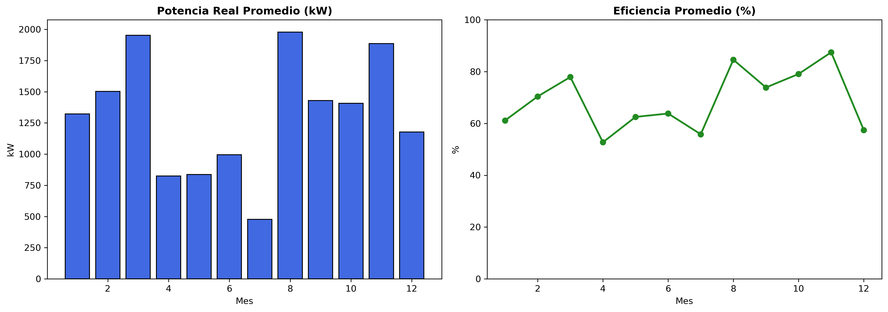
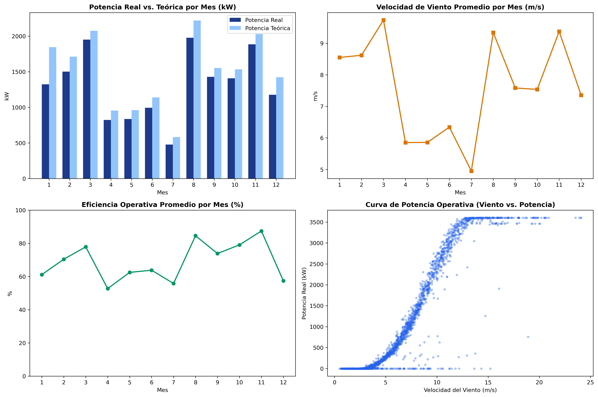

# 💨 Wind Turbine SCADA Performance Analysis


Proyecto de Análisis de Datos utilizando información SCADA de una turbina eólica.

El proyecto incluye el proceso completo de carga, limpieza, transformación (ETL), análisis exploratorio (EDA), cálculo de indicadores (KPIs) y visualización de datos mediante Python. Los datos procesados quedan preparados para su análisis en Power BI.

---

## 📂 Estructura del Proyecto

```
Wind-Turbine-Scada-Dataset
│
├── dashboard/
│   └── images/
├── data/
│   ├── raw/
│   └── processed/
├── notebooks/
├── dataset_info.txt
├── README.md
└── requirements.txt
```

---

## 🛠️ Tecnologías utilizadas

- Python
- Pandas
- NumPy
- Matplotlib
- Jupyter Notebook
- Power BI (Próximamente)

---

## 📊 Indicadores Principales (KPIs)

| Indicador | Valor |
|-----------|------:|
| Registros analizados | 50.530 |
| Velocidad promedio del viento | 7.56 m/s |
| Potencia real promedio | 1.307,68 kW |
| Potencia teórica promedio | 1.492,18 kW |
| Eficiencia operativa promedio | 68,68 % |

---

## 📈 Contenido del Proyecto

- Carga del conjunto de datos.
- Limpieza y transformación de datos (ETL).
- Conversión y procesamiento de fechas.
- Cálculo de indicadores operativos (KPIs).
- Análisis exploratorio de datos (EDA).
- Visualización de variables y tendencias.
- Exportación del conjunto de datos procesado para Power BI.

---

## 🔍 Principales hallazgos

- La producción de energía presenta un comportamiento estacional claramente definido.
- La potencia real sigue, en términos generales, la tendencia de la curva de potencia teórica.
- Los meses con mayor velocidad promedio del viento registran una mayor generación de energía.
- El conjunto de datos procesado queda preparado para su análisis mediante Power BI.

---

## ⚠️ Limitaciones del análisis

Se detectaron registros con eficiencias superiores al 100 %, principalmente a bajas velocidades del viento (≈3 m/s).

Estos valores no indican que la turbina supere sus límites físicos de eficiencia. Lo más probable es que estén asociados a:

- La elevada sensibilidad de la curva de potencia en la zona de arranque (*cut-in*).
- Variaciones rápidas de la velocidad del viento.
- Pequeños desfases temporales entre sensores SCADA.
- Incertidumbre propia de las mediciones.

Por ello, estos registros deben interpretarse como valores atípicos propios de este tipo de sistemas y no como un aumento real del rendimiento de la turbina.

---

## 📷 Visualizaciones

### Dashboard 1



### Dashboard 2



---

## 📁 Organización de los datos

El archivo original del dataset se encuentra en:

```
data/raw/
```

El archivo procesado generado durante el análisis se guarda en:

```
data/processed/
```

La información sobre el origen del dataset y la descripción de las variables se encuentra en:

```
dataset_info.txt
```

---

## 🚀 Próximas mejoras

- Dashboard interactivo en Power BI.
- Aplicación de escritorio desarrollada con Tkinter.
- Automatización del procesamiento de archivos SCADA.
- Generación automática de reportes.
- Modelos de Machine Learning para predicción de potencia.
- Detección de anomalías.
- Análisis de mantenimiento predictivo.

---

**Proyecto de Ciencia de Datos y Análisis de Datos aplicado a sistemas SCADA de generación eólica.**